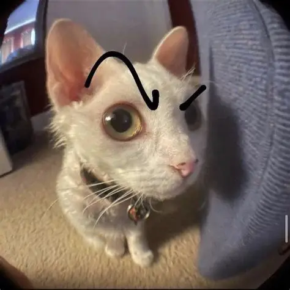

# Docker Example (EventEase)
## Brief Overview

## Requirements
| Requirement | Version|
| ----------- | ----------- |
| .NET | 10 |
| Visual Studio | 2026 |
| SSMS | 22+ |
| Docker Desktop | Latest |
| SQL Server | 2025+ |

## Steps to Run
1. Clone down the repo using the command line ```git clone <link>```

## Screenshots
### Home Screen



### Events

### Venues

### Bookings

## Links
### GitHub
[GitHub Repo](https://github.com/EMECPE/cldv6211-g1-2026-ca-docker-rudderz243)

### YouTube
Make sure to use the CheatSheet to make your life easier!