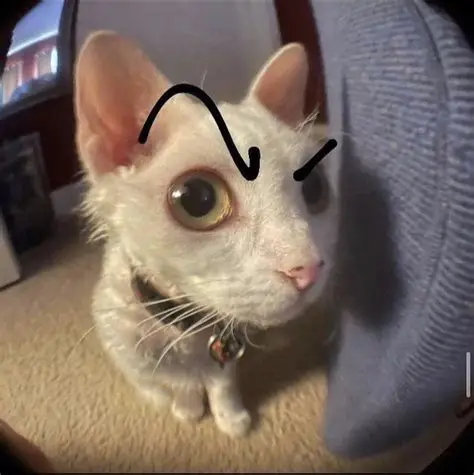

# Docker Example
## Brief Overview

## Requirements
| Software | Version |
| ----------- | ----------- |
| .NET | 10+ |
| Visual Studio | 2026+ |
| SQL Server | 2025+ |
| SSMS | 22+ |


## Steps to Run
1. Clone down the repo

``` git clone <link>```


## Screenshots
### Home Screen

### Events

### Bookings

### Venues

## Links
### YouTube Link

### GitHub Link